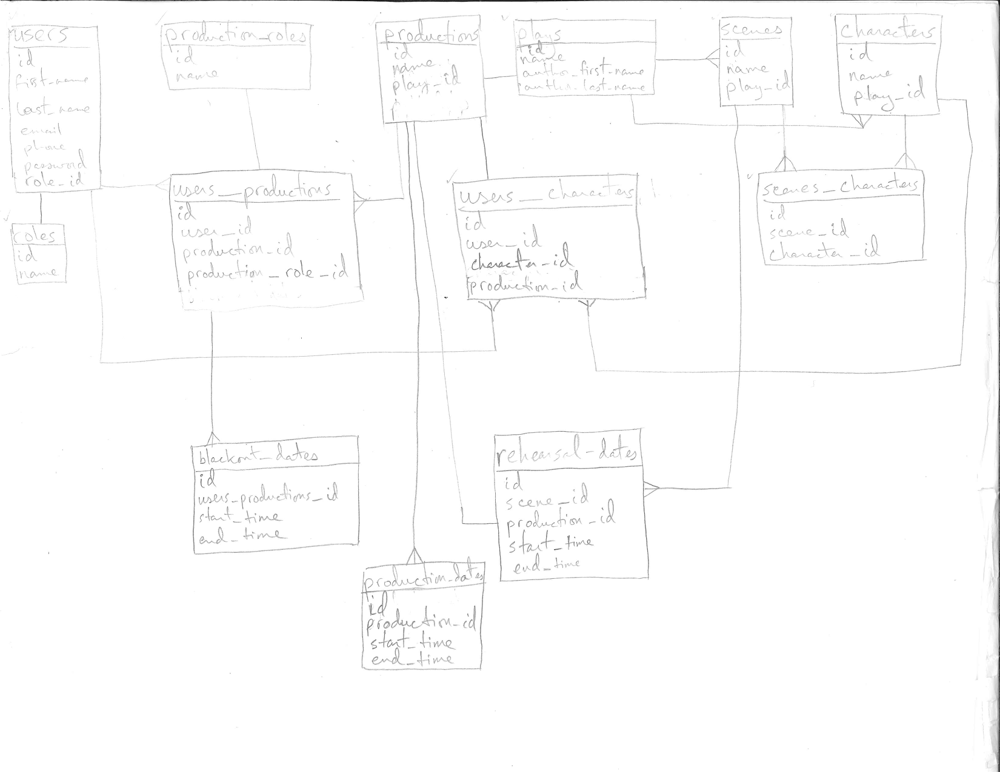

# TheatriCAL

Theatre rehearsals are notoriously difficult to schedule. Actors typically submit black-out dates on paper, email, or via google forms. Regardless of the method, theatre directors need to manually collate the information in order to schedule rehearsals. TheatriCAL puts all of the information necessary to schedule rehearsals in one place.

[Demo Video](https://youtu.be/6_qVLI79CWY)

## Stack
While all of the information is contained withing this README, this project is split into two separate repositories:

[TheatriCAL-UI](https://github.com/cdcasey/theatrical-ui)
 
[TreatriCAL-API](https://github.com/cdcasey/theatrical)

TheatriCAL is built with the following technologies:
* Node
* Express
* Knex
* PostgreSQL
* Bcrypt
* Bootstrap
* React
* Axios
* Big Calendar

## Challenges

The first challenge was organizing the data model. This app has many separate pieces of data that need to relate in some way. The two pieces of data that the purpose of this app revolve around are scenes and blackout dates. A director should be able to schedule a scene rehearsal, and the app should know who is needed for that rehearsal and who is unavailable. I originally thought I could just put lists of dates into tables as jsonb objects. While that did work on a technical level, breaking the dates out into their own tables definitely simplified working with the data. After quite a bit of thinking, planning, and testing, I created the following ERD:

